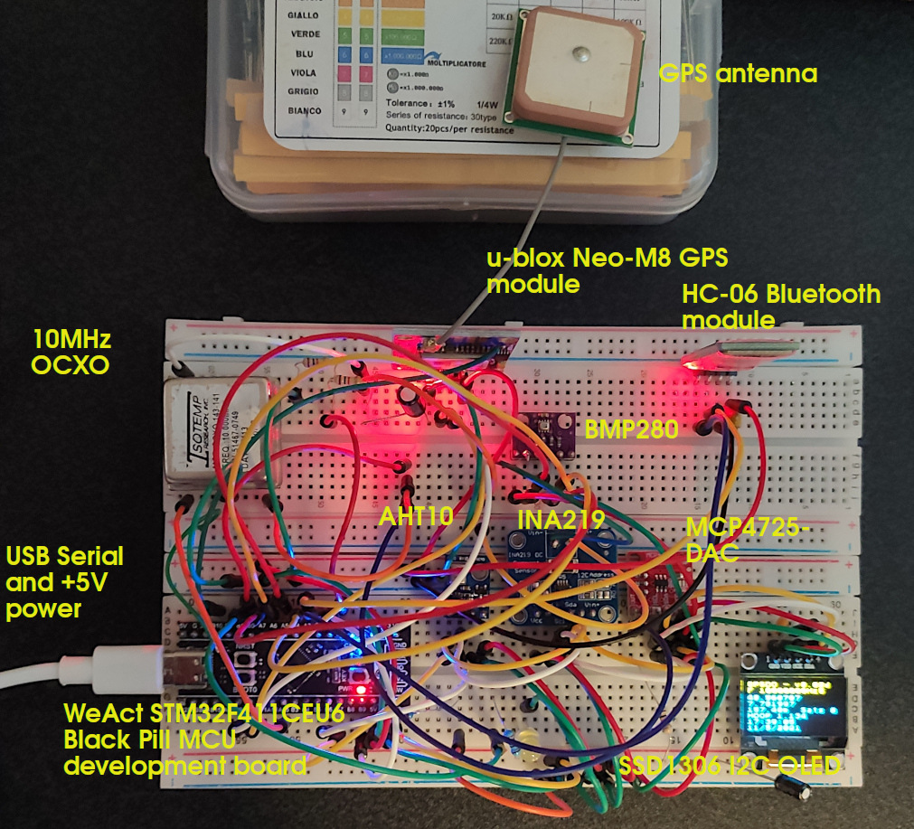
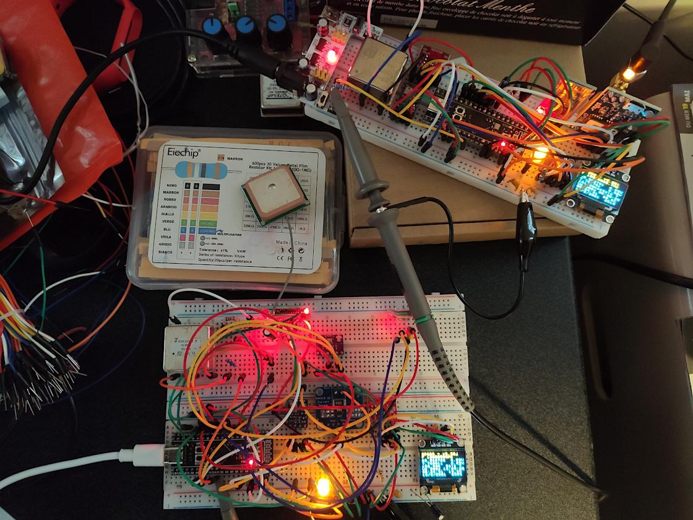
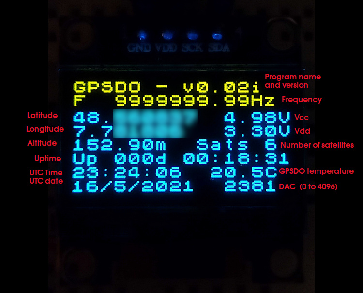

# An STM32 GPSDO

Designing, assembling, programming and testing an ultra-low-cost GPS-disciplined oven controlled crystal oscillator / lab clock based on an 100 MHz STM32 32-bit ARM microcontroller

**Keywords**: STM32, GPS, GPSDO, OCXO, 10MHz, crystal oscillator, frequency standard, atomic clock

## Introduction

I have been following the thread by the late Lars about his inspirational DIY Arduino GPSDO project. And I checked the dozen or so GPSDO projects published on the net.
Then I decided to join the party and design and build my own.

I didn't quite know what I was getting into, but after a couple of months waiting for the parts to come from China, and then another couple of months writing the firmware, I have a working, blinking, timekeeping and happily and precisely oscillating GPSDO.

Like with Lars' design, any OCXO, DOCXO or even rubidium source can be used, but the recommended oscillator is an inexpensive used square wave 10MHz 5V OCXO, which is what I am using in the breadboard prototype. These OCXOs are available from various sources on the net, recycled from decommissioned telecom equipment and sometimes still soldered onto a piece of PCB, for around 10€ or less (< US $12). The OCXO is the most expensive part in this GPSDO.

For Lars' design check following links:
- Original Lars' EEVBlog forum thread: https://www.eevblog.com/forum/projects/lars-diy-gpsdo-with-arduino-and-1ns-resolution-tic/
- GitHub project combaning all information in one place: https://github.com/AndrewBCN/Lars-DIY-GPSDO

The second most expensive part is the GPS receiver module. I strongly recommend a u-blox Neo-M8 GPS module with an SMA antenna connector. With a u-blox Neo-M8, I am still getting 5~9 satellites even indoors in my basement lab. The much cheaper Neo-M6 struggles to get a fix in the same conditions.

## Features

I have decided to build my own version of a **10MHz GPSDO** with the following features:
- **Very low cost i.e**. < 30 EUR ($35), short and easily purchased BOM.
- **Acceptable performance (+/- 1ppb)** "out of the box", can be fine tuned over time.
- Uses an **100 MHz STM32F411CEU6 "Black Pill"** microcontroller module, programmed in C/C++ using the Arduino IDE ([STM32duino](https://github.com/stm32duino/Arduino_Core_STM32)).
- Requires only a **5V @ 1A** power supply, supplied through a USB C cable.
- Compact and portable.
- Optionally battery powered (allows taking it outdoors for optimal satellite signal reception).
- **Optional modules**
  - **BMP280** for atmospheric pressure and temperature monitoring,
  - **AHT10**  for temperature and humidity monitoring,
  - **INA219** for OCXO power consumption monitoring,
  - **HC-06** for wireless communication with a PC/mobile using Bluetooth UART.
- Extensive logging of various operating parameters to allow further software tuning.
- An optional small OLED displaying room temperature, UTC time, uptime, operating status, measured frequency.
- **New!** Optional UTC-aligned 1PPS output using a **picDIV**.
- It uses a digital **FLL (Frequency Locked Loop)**,
  - **New!** It can also use a **PLL (Phase Locked Loop)**.
- **OXCO Voltage control** using a **16-bit DAC** provided by a **2kHz PWM** output pin on the STM32F411CEU6

## The first breadboard prototype

In normal operation this is displayed on the small OLED:

## Authors

- André Balsa, April 2021
